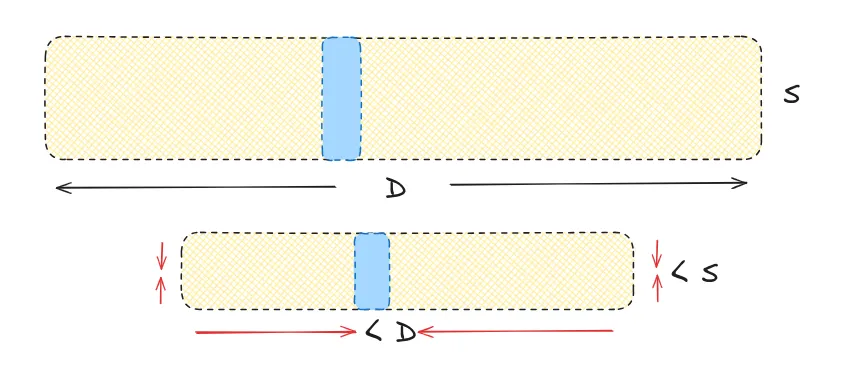
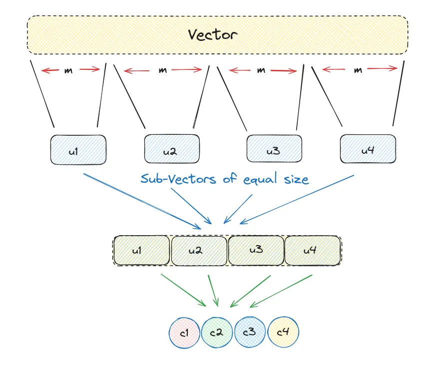

# Understanding LanceDB's IVF-PQ index

An index is a data structure that represents data in a way that makes it more efficient to search and retrieve. Using an index is faster, but less accurate than kNN or brute force search because, in essence, the index is a lossy representation of the data.

LanceDB is fundamentally different from other vector databases in that it is built on top of [Lance](https://github.com/lancedb/lance), an open-source columnar data format designed for performant ML workloads and fast random access. Due to the design of Lance, LanceDB's indexing philosophy adopts a primarily *disk-based* indexing philosophy.

## IVF-PQ

IVF-PQ is a composite index that combines inverted file index (IVF) and product quantization (PQ). The implementation in LanceDB provides several parameters to fine-tune the index's size, query throughput, latency and recall, which are described later in this section.

### Product quantization

Quantization is a compression technique used to reduce the dimensionality of an embedding to speed up search. 



Product quantization (PQ) works by dividing a large, high-dimensional vector of size into equally sized subvectors. Each subvector is assigned a "reproduction value" that maps to the nearest centroid of points for that subvector. The reproduction values are then assigned to a codebook using unique IDs, which can be used to reconstruct the original vector.



It's important to remember that quantization is a *lossy process*, i.e., the reconstructed vector is not identical to the original vector. This results in a trade-off between the size of the index and the accuracy of the search results.

As an example, consider a starting 128-dimensional vector consisting of 32-bit floats. Quantizing it to an 8-bit integer vector with **only 8 dimensions**, we can cause a significant reduction in memory requirements.

!!! example "Effect of quantization"

    Original: `128 × 32 = 4096` bits  
    Quantized: `8 × 8 = 64` bits  

    Quantization results in a **64x** reduction in memory requirements for each vector in the index, which is substantial.

### Inverted file index

While PQ helps with reducing the size of the index, IVF primarily addresses search performance. The primary purpose of an inverted file index is to facilitate rapid and effective nearest neighbor search by narrowing down the search space.

In IVF, the PQ vector space is divided into *Voronoi cells*, which are essentially partitions that consist of all the points in the space that are within a threshold distance of the given region's seed point. These seed points are used to create an inverted index that correlates each centroid with a list of vectors in the space, allowing a search to be restricted to just a subset of vectors in the index.


During query time, depending on where the query lands in vector space, it may be close to the border of multiple Voronoi cells, which could make the top-k results ambiguous and span across multiple cells. To address this, the IVF-PQ introduces the `nprobe` parameter, which controls the number of Voronoi cells to search during a query. The higher the `nprobe`, the more accurate the results, but the slower the query.


## Putting it all together

We can combine the above concepts to understand how to build and query an IVF-PQ index in LanceDB.

### Construct index

```python
# Create and train the index for a 1536-dimensional vector
# Make sure you have enough data in the table for an effective training step
tbl.create_index(metric="L2", num_partitions=256, num_sub_vectors=96)
```

* `metric`: Use a euclidean distance metric. We also support "dot" and "cosine" distance.
* `num_partitions`: The number of partitions in the IVF portion of the index.
* `num_sub_vectors`: The number of sub-vectors (M) that will be created during Product Quantization (PQ). For D dimensional vector, it will be divided into M of D/M sub-vectors, each of which is presented by a single PQ code.

### Query the index

```python
# Search using a random 1536-dimensional embedding
tbl.search(np.random.random((1536))) \
    .limit(2) \
    .nprobes(20) \
    .refine_factor(10) \
    .to_pandas()
```

The above query will perform a search on the table `tbl` using the given query vector, with the following parameters:

* `limit`: The number of results to return
* `nprobes`: The number of probes determines the distribution of vector space. While a higher number enhances search accuracy, it also results in slower performance. Typically, setting `nprobes` to cover 5–10% of the dataset proves effective in achieving high recall with minimal latency.
* `refine_factor`: Refine the results by reading extra elements and re-ranking them in memory. A higher number makes the search more accurate but also slower.
* `to_pandas()`: Convert the results to a pandas DataFrame

And there you have it! You now understand what an IVF-PQ index is and how to create and query in LanceDB.
