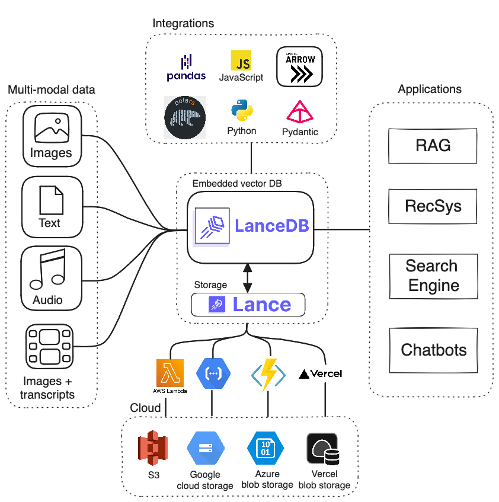

# LanceDB

LanceDB is an open-source vector database for AI that's designed to store, manage, query and retrieve embeddings on large-scale multi-modal data. The core of LanceDB is written in Rust 🦀 and is built on top of [Lance](https://github.com/lancedb/lance), an open-source columnar data format designed for performant ML workloads and fast random access.

Both the database and the underlying data format are designed from the ground up to be **easy-to-use**, **scalable** and **cost-effective**.

## Truly multi-modal

Most existing vector databases that store and query just the embeddings and their metadata. The actual data is stored elsewhere, requiring you to manage their storage and versioning separately.

LanceDB supports storage of the *actual data itself*, alongside the embeddings and metadata. You can persist your images, videos, text documents, audio files and more in the Lance format, which provides automatic data versioning and blazing fast retrievals and filtering via LanceDB.

## Open-source and cloud solutions

LanceDB is available in two flavors: **OSS** and **Cloud**.

LanceDB **OSS** is an **open-source**, batteries-included embedded vector database that you can run on your own infrastructure. "Embedded" means that it runs *in-process*, making it incredibly simple to self-host your own AI retrieval workflows for RAG and more. No servers, no hassle.

LanceDB **Cloud** is a SaaS solution that runs serverless in the cloud, making the storage clearly separated from compute. It's designed to be cost-effective and highly scalable without breaking the bank. LanceDB Cloud is currently in private beta with general availability coming soon, but you can apply for early access with the private beta release by signing up below.

[Try out LanceDB Cloud](https://noteforms.com/forms/lancedb-mailing-list-cloud-kty1o5?notionforms=1&utm_source=notionforms){ .md-button .md-button--primary }

## Why use LanceDB?

* Embedded (OSS) and serverless (Cloud) - no need to manage servers

* Fast production-scale vector similarity, full-text & hybrid search and a SQL query interface (via [DataFusion](https://github.com/apache/arrow-datafusion))

* Native Python and Javascript/Typescript support

* Store, query & manage multi-modal data (text, images, videos, point clouds, etc.), not just the embeddings and metadata

* Tight integration with the [Arrow](https://arrow.apache.org/docs/format/Columnar.html) ecosystem, allowing true zero-copy access in shared memory with SIMD and GPU acceleration

* Automatic data versioning to manage versions of your data without needing extra infrastructure

* Disk-base index & storage, allowing for massive scalability without breaking the bank

* Ingest your favorite data formats directly, like pandas DataFrames, Pydantic objects, Polars (coming soon), and more

## Documentation guide

The following pages go deeper into the internal of LanceDB and how to use it.

* [Getting started](basic.md): Get started with LanceDB and vector DB concepts
* [Working with tables](guides/tables.md): Work with tables
* [Indexing](ann_indexes.md): Understand indexing and how to create indexes
* [Vector search](search.md): Perform vector similarity search
* [Full-text search](fts.md): Perform full-text search
* [Embedding functions](embeddings/index.md): Work with embedding functions in LanceDB
* [Ecosystem Integrations](integrations/index.md): Integrate LanceDB with the PyData ecosystem
* [Python API Reference](python/python.md): LanceDB Python OSS and Cloud API references
* [JavaScript API Reference](javascript/modules.md): LanceDB JavaScript OSS and Cloud API references
